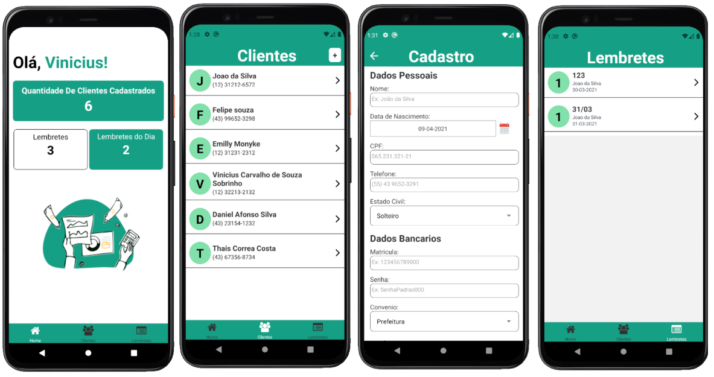

# SafeApp

>Aplicativo de cadastro de clientes e lembretes de compromissos

## Funcionalidades

* Cadastro de Clientes
* Cadastro de Lembretes

## Telas




Instalando dependencias
```bash
$ npm install
```

Rodando projeto
```bash
$ npx react-native run-android
```

Foi ultilizado nesse projeto :

* VSCode
* Android Studio
* Firebase
* React Native

